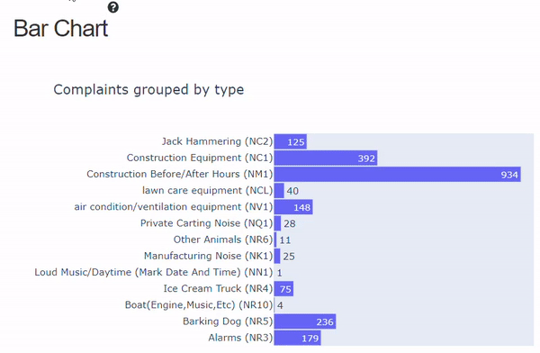

# Noise Complaint Dashboard
The following dashboard allows you to dive deeper and find trends in Noise complaints over the last two months. 
You also have the ability to view street construction permits issued 
in the last two months.
Created by Siddhanth Shetty for the [Sounds Of New York City (SONYC)](https://wp.nyu.edu/sonyc/)
project with support from Charlie Mydlarz and Graham Dove
The info buttons next to each plot will provide further details on how it can be filtered or interacted with. 

## Example Walkthrough Scenario
As a resident of Brooklyn, there have been a lot of constructions over the past weekend. Using this tool we can
get some insight into the constructions taking place around us and see if other people have also been complaining.

* Firstly we check Brooklyn and uncheck the other boroughs. This filters all the other plots on the map.

* We then filter only construction complaints on the bar plot as seen below.

This filters the map and the heatmap. 

* We can switch the heatmap to be normalized within each complaint type and then select the last week(August 16th- 
August 23rd on the heatmap to see how many complaints have occured over the period.

* Finally we can use the map to zoom into our area of interest, select points to see what dates the complaints occured(
this will however reset the other two plots)
and even view the street construction permits if there is one in the area.

